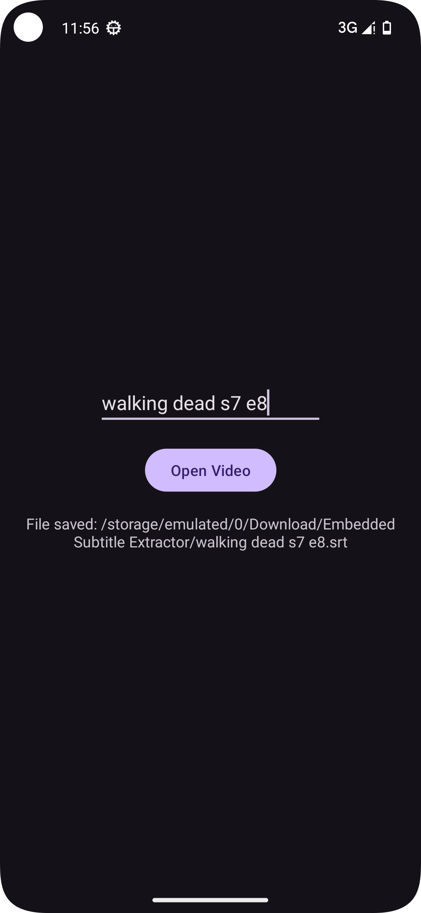

# Android Embedded Subtitle Extractor
Extract Embedded Subtitles From Videos in Android Java with FFmpeg 

## Overview

**Android Embedded Subtitle Extractor** is an Android app developed in Java that allows users to extract embedded subtitles from videos. This app utilizes **FFmpeg** to handle video files and extract subtitle streams, saving them in the **SRT** format. It is designed to work on Android devices running Android 13 (API level 33) or higher.

## Features

- **Video Selection**: Allows the user to select a video from their device storage.
- **Subtitle Extraction**: Extracts embedded subtitles from the selected video file.
- **SRT Format**: Saves the extracted subtitles in the **SRT** format.

## Minimum Requirements

- **Android Version**: Android 13 (API level 33) or higher
- **Java**: Written in Java with FFmpeg for subtitle extraction

## FFmpeg

This app relies on the **FFmpeg** library for extracting embedded subtitles. FFmpeg is a comprehensive multimedia framework used for video, audio, and subtitle processing.

For more information, visit the official FFmpeg website:  
[FFmpeg Official Site](https://ffmpeg.org)
[FFmpeg Github](https://github.com/tanersener/mobile-ffmpeg)

## Screenshot  

